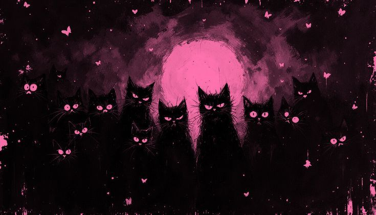

<p align="center">
  
</p>

<p align="center">
  
</p>


<table align="center">
<tr>

<td>

```yaml
name: Ana Clara
located_in: Brazil

current_focus:
  - Software Engineering

learning:
  - C
  - JavaScript

interests:
  - Technology
  - Cybersecurity
  - System Design
  - Artificial Intelligence
```

</td>

<td>
  
</td>


</tr>
</table>


<table align="center">
<tr>

<td>
  
</td>

<td>

<h2 align="center">✦ Technologies ✦</h2>

<p align="center">
  
</p>

</td>

</tr>
</table>


<table align="center">
<tr>
  <td>
<h2 align="center">✦ Statistics ✦</h2>

<p align="center">
  
</td>
<td>
  
</p>
</td>

</tr>
</table>


<h2 align="center">✦ Contributions ✦</h2>


<p align="center">
  
</p>

<br>

<p align="center">
  
</p>

<p align="center">
  <i>"Systems. Logic. Creation."</i>
</p>

<p align="center">
  
</p>
